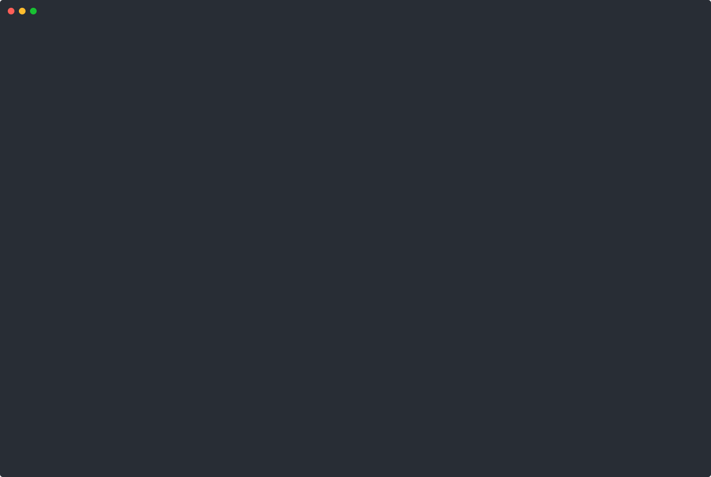
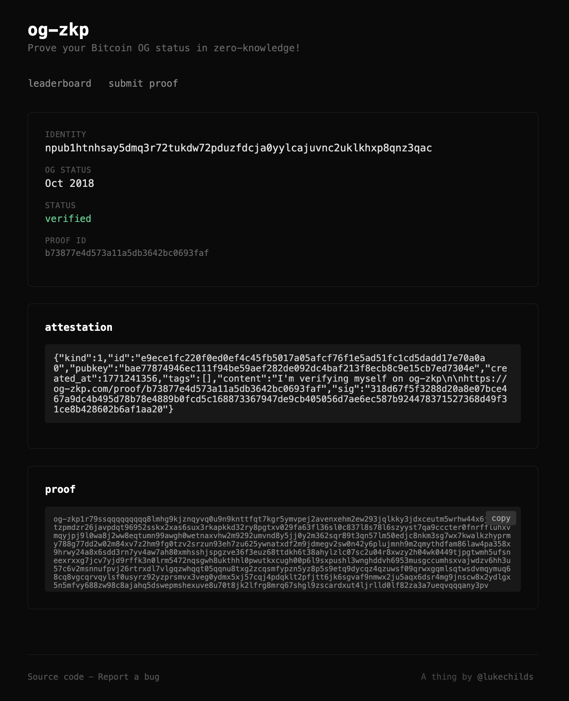

# og-zkp

> Prove your Bitcoin OG status in zero-knowledge - [og-zkp.com](https://og-zkp.com)

og-zkp allows you to privately prove the calendar month (e.g January 2011) you first received Bitcoin, tied to any identity you choose, without exposing your address, transaction, the specific block it was confirmed in or the exact date it was confirmed. The output is a compact cryptographic proof that anyone can verify instantly.

You sign a message with a Bitcoin private key. The og-zkp prover will then trace the key back to it's first received transaction, verify that transaction was included in a real Bitcoin block, attests to the calendar month that block was mined and collapses all of that into a single zero-knowledge proof.

You can attest to a known identity, or a throwaway anonymous identity. The verifier learns only two things: your identity and the month you first received Bitcoin. Nothing else leaks.



A proof shows that a Bitcoin key signed a claim about an identity, but not that the identity actually belongs to the person making the claim. [og-zkp.com](https://og-zkp.com) closes that loop by requiring the claimed identity to point back to the proof. After submitting, you publish a short attestation from that identity, such as a tweet or Nostr note, and [og-zkp.com](https://og-zkp.com) checks both sides before marking the proof as verified.

[](https://og-zkp.com)

## Example

### Sign

Sign a message with your Bitcoin private key comitting to your identity. Most good wallets like Bitcoin Core, BlueWallet, Electrum and Sparrow can do this. All common address types are supported.

Currently X and Nostr are supported. Sign the string `og-zkp <identity>` where `<identity>` is `<npub>` or `x.com/<username>`.

```bash
$ bitcoin-cli signmessage 1LukeQU5jwebXbMLDVydeH4vFSobRV9rkj "og-zkp x.com/lukechilds"
HE6QfyPFmJvCGjWohZYAVa+pbdSRjeQpdNbXp6zNbDCnEN65xmK+WYidKlt6J1E/GDJpmLcatjEazVo5wqOg6wM=
```

### Prove

Run the og-zkp prover. The easiest way is with Docker, although you can also build from source or grab a binary from the release page.

```bash
$ docker run -it ghcr.io/lukechilds/og-zkp prove \
  --message "og-zkp x.com/lukechilds" \
  --address "1LukeQU5jwebXbMLDVydeH4vFSobRV9rkj" \
  --signature "HE6QfyPFmJvCGjWohZYAVa+pbdSRjeQpdNbXp6zNbDCnEN65xmK+WYidKlt6J1E/GDJpmLcatjEazVo5wqOg6wM="
og-zkp v0.1.0
Looking up first-seen txid for address...
First seen txid: e8e96692d721276a86e8b71ef273df6c45fa44d62f3b73ea0b5d1e3c7f6def4f
Fetching raw tx...
Fetching transaction inclusion proof...
Generating block inclusion proof...
Proving...
Proof generated successfully

OG Status: October 2018
Identity:  x.com/lukechilds

Submit your proof at https://og-zkp.com

og-zkp1r79ssqqqqqqqqq8l6h846jznqy2q0u8trkuxjnvz9xa8g02567kxenkfjed4y4s0a9pcu63g959xk3dwhwyxtcew3z9rqa2jvvfqsw2pc4hlzqaxy29tswd0nd0nsa82uc29g4zyn5a0zqcaaq7vs8nuzv0lmsl0u8qwzu879qp0zsuwwfelfnncep4r4hln0grnrvrtshtl8w6mzujcv4x88mf45kku0ullere7j9xdf2y4zkem3dn87z7nxj9w7cmg0xsjajf96g0x25e9pw7wtepukt5wljgklszjmw0d0lt8zadr0xtne8a9yc4ndk2hzn4ccw6k24ad6dh008fhp7jp09z5veveyhgehjpdcdahaqp6ac8gag3r54vn5fqy0y9pkfl5un7ycmxw2j40jassetpjq7vug5f382thh7p348fgdn0c0lxm46xqy5y4w0jvw5hzl402atn4qdaa5vjavwr0tvcv4qn994ujlrgvzxsh5gwxz5jwrz0l96tctpu9frt35uj96g682ae487he8nff2d7mz0x560hcvdjxyszjs83qcaffgsaelfx7qnle7h9v4r07h0z69lv7c4vswfvhpjfjctzjw0h3juk2lzwkdt7uxl7qgd6qzvgqxtjcqsptqpm6cyfzpsznjqzvvqq4wnuku5zq8luqex5ppzjgq90sq3xgxm0qqpdd7q63yqrsfqjctew8c8y0e0shqy8yqtxz4dh560r33wgj0unumyxfmanpule7jdxxk9enl8hqn2kndhqcfq56rmef5zttyupwv8apxmea44zeaf64996rdmhm0meeqvqqq2rww9h
```

You can then optionally submit your proof at [og-zkp.com](https://og-zkp.com) and publish a social attestation back to it from the linked identiy.

### Verify

Anyone can verify without learning the exact address/block/date.

```bash
$ docker run ghcr.io/lukechilds/og-zkp verify "og-zkp1r79ssqqqqqqqqq8l6h846jznqy2q0u8trkuxjnvz9xa8g02567kxenkfjed4y4s0a9pcu63g959xk3dwhwyxtcew3z9rqa2jvvfqsw2pc4hlzqaxy29tswd0nd0nsa82uc29g4zyn5a0zqcaaq7vs8nuzv0lmsl0u8qwzu879qp0zsuwwfelfnncep4r4hln0grnrvrtshtl8w6mzujcv4x88mf45kku0ullere7j9xdf2y4zkem3dn87z7nxj9w7cmg0xsjajf96g0x25e9pw7wtepukt5wljgklszjmw0d0lt8zadr0xtne8a9yc4ndk2hzn4ccw6k24ad6dh008fhp7jp09z5veveyhgehjpdcdahaqp6ac8gag3r54vn5fqy0y9pkfl5un7ycmxw2j40jassetpjq7vug5f382thh7p348fgdn0c0lxm46xqy5y4w0jvw5hzl402atn4qdaa5vjavwr0tvcv4qn994ujlrgvzxsh5gwxz5jwrz0l96tctpu9frt35uj96g682ae487he8nff2d7mz0x560hcvdjxyszjs83qcaffgsaelfx7qnle7h9v4r07h0z69lv7c4vswfvhpjfjctzjw0h3juk2lzwkdt7uxl7qgd6qzvgqxtjcqsptqpm6cyfzpsznjqzvvqq4wnuku5zq8luqex5ppzjgq90sq3xgxm0qqpdd7q63yqrsfqjctew8c8y0e0shqy8yqtxz4dh560r33wgj0unumyxfmanpule7jdxxk9enl8hqn2kndhqcfq56rmef5zttyupwv8apxmea44zeaf64996rdmhm0meeqvqqq2rww9h"

OG Status: October 2018
Identity:  x.com/lukechilds

✓ Proof is valid
```

## Airgap mode

To be sure no data can leak you can run the prover in offline airgap mode by providing the raw transaction and spv proof directly. You can run this in on an offline machine for a physical airgap. Or you can run the Docker container with networking disabled (`--net none`) for a soft airgap:

```bash
docker run -it \
  --net none \
  ghcr.io/lukechilds/og-zkp prove \
  --message "og-zkp x.com/lukechilds" \
  --address "1LukeQU5jwebXbMLDVydeH4vFSobRV9rkj" \
  --signature "HE6QfyPFmJvCGjWohZYAVa+pbdSRjeQpdNbXp6zNbDCnEN65xmK+WYidKlt6J1E/GDJpmLcatjEazVo5wqOg6wM=" \
  --transaction "01000000000101b0fbbbccf54b14e37ef8709a4410bdd6db580fa7dc628106619e71220068ce630500000017160014b44aa221767d8b6d6e1300973719587b4a70ff78ffffffff02360f000000000000160014a6366f1659517ec2af9001e468f5defade31178510270000000000001976a914da6473ed373e08f46dd8003fca7ba72fbe9c555e88ac0247304402207fbb404bc1d79eaea59fd091f7df0c0cbfc367dec29b945be3f829ed742e01f60220295547047d5cf5ec27ce4bb25ba767cf560046e8c126795ed5e04d4810090fd2012103a66311e6776633e771690bdfa7bfea4a74cfb93b21005b704037671c710d0b9200000000" \
  --spv-proof "00000020c12df22f6c84f6927e63323d6762077ebc7b6d9e7a1020000000000000000000979f6cab6cd5cd47f6057bd1d49871f5a352b111f47a61c5ed8f9d371b6f8634a7d6c15b91c125176669d50d200b00000d71b32e7ebaecc4f44c637c224b5d54fc23fa37fb4faca57fd9603c5a21f373e20d91ab1288f566a5689d8ed3d2b17c94e8ce3320b03882cef7331309472f28cc3631028ba0a6ac08b7fd623dffb48e084bc587963426927cb7826ba6926ca7c22958835f6f94685952f3d9ff12ac91f6a3349dd000b29cf297220eefd4bf20e3c51eb470a7c94ccecca95db3695c110e9f89502ac4cdf64d6d1ddf0e48b20a819327bbe5c2da1adca6aacbfe378123dc77ae993dd7a9330dd43acf83b2ee6cde4d89f02d01864936146f6070f05fb8409789df8ab7414baadd5763f32ca3fdcb4fef6d7f3c1e5d0bea733b2fd644fa456cdf73f21eb7e8866a2721d79266e9e834282a6acaa3fe1d08aa11d5f0892dc7f9ff629f2efb8a7e190fb7e1e029b4cde8c0b00eea6730d9258aca5208fe5afcc5041e547b9a81f5d54f2ce9bec1e9e3b532622be369a572a783fbaaa2631dc86b7a0f1b412adeb57c51a42f5b8bd8436b31bc8defacd89a6030086fe0abbc4a8be51ed2280d448843b44eb1a28b145981fc4900f9709e02223b25f12baf7c664c15482b0818f538d4e4deb96a1cb3cd04bb550b00"
```

## How it works

The prover is split into a [host](core/src/prove.rs) and a [guest](core/src/guest.rs). The host runs outside the VM and gathers inputs. It looks up the address's first-seen transaction via mempool.space, fetches the raw transaction and SPV proof, and generates a Merkle proof against the compiled-in set of all Bitcoin block hashes. It then passes all of this into the [RISC Zero](https://risczero.com) zkVM guest program.

You can also supply the raw transaction and SPV proof yourself (see [Airgap mode](#airgap-mode)), or point to a self-hosted mempool.space instance with `--mempool-api`.

Inside the guest, every step is proven in zero-knowledge:

1. **Recover the public key.** The guest takes the Bitcoin signed message and recovers the signer's public key using secp256k1 ECDSA recovery. The message must start with `og-zkp ` followed by the user's chosen identity string.

2. **Derive the output script.** The recovered public key is converted into the appropriate Bitcoin output script for the address type used (P2PKH, P2SH-P2WPKH, P2WPKH, or P2TR).

3. **Match it to a transaction output.** The guest decodes the raw transaction and checks that at least one output pays to the derived script. This links the signing key to a real on-chain receive.

4. **Verify transaction inclusion (SPV).** The Bitcoin Merkle block proof is checked to confirm the transaction is included in a specific block header.

5. **Verify block inclusion.** The block hash is checked against a Merkle tree of all known Bitcoin block hashes, proving the block is part of the real chain. The Merkle root is passed into the guest as input rather than compiled in, so the block hash set can be updated to include new blocks without changing the zkVM program hash or invalidating previous proofs. The root is committed to the proof output so the verifier can confirm which block set was used.

6. **Collapse the timestamp to a calendar month.** The block header's timestamp is rounded down to the first second of its calendar month. This is what gets committed, not the exact block height or date.

7. **Commit the output.** The guest program outputs exactly three values: the block inclusion Merkle root, the calendar month timestamp, and the identity string.

## License

MIT © Luke Childs
